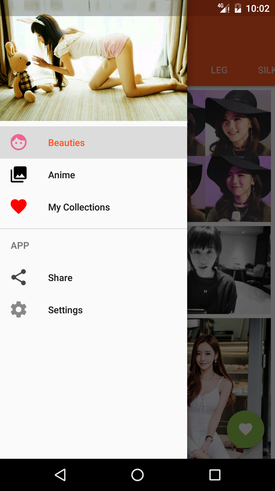

Android 红包问答群 459232356

**五次元妹子** 是一款看妹子的APP ([获取apk](https://github.com/DanteAndroid/Beauty/releases)）
---

## Feature
0. 它是我另一个库 [Knowledge](https://github.com/DanteAndroid/Knowledge) 的 Rxjava &精简版
1. Retrofit + Rxjava，让网络请求和解析数据更轻松、直观
2. **NO MVP**，没有大量绕人的接口
3. 只保留了 Knowledge 中的美图功能，结构清晰更适合新手学习
4. 使用[BRVAH](http://www.recyclerview.org/)，妈妈再也不用担心我写adapter头疼的问题了

## Screenshot

## Q&A
- Q: 我不会Rxjava，怎么办？ 
A: 我建议你了解下[Rxjava](http://gank.io/post/560e15be2dca930e00da1083)，它很好用，而且Google也出了[类似的库](https://github.com/google/agera)，以后必然是发展趋势。

- Q: 为啥返回的时候没有SharedElement的动画效果？ 
A: 我研究过[这样的效果](http://stackoverflow.com/questions/27304834/viewpager-fragments-shared-element-transitions)，但是最终即使是照搬别的项目的代码还是失败了。请知道怎么写的务必教教我。

## Support
如果你喜欢这个repository，请我喝杯咖啡，我会让它更完美~

